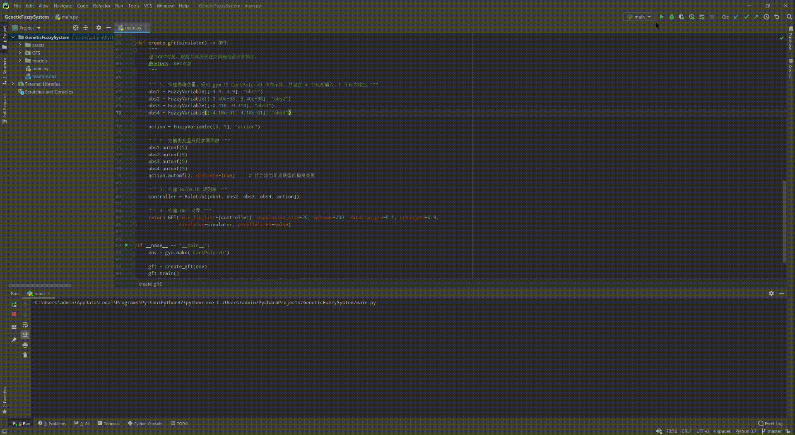

### GeneticFuzzySystem Python Package

该项目是使用 python 实现的 GFS/GFT 算法包，使用时请将GFS包放入项目路径，并在项目文件中引入该工具包进行使用。

（GFS算法原理参考资料可见：[英文版](https://www.cs.princeton.edu/courses/archive/fall07/cos436/HIDDEN/Knapp/fuzzy004.htm)，[中文版](https://blog.csdn.net/qq_38638132/article/details/106477710)）

GFS 库中包含了 GFS 和GFT 两种算法类，当问题只需要一个 GFS 决策器时可以考虑使用 `BaseGFS` 基类来求解问题，当求解问题中包含 2 个或 2 个以上的决策器时需要使用 `BaseGFT` 基类来进行问题求解，下面分别对两种基类的使用方法进行简单介绍，示例代码见 "main.py"：


> 1. GFS 单决策器的使用方法

首先从 GFS 包中引入 BaseGFS 基类，

```python
from GFS.GeneticFuzzySystem import BaseGFS
```

BaseGFS 内置了基本的 GFS 对象所具备的方法函数，但同时也预留了抽象方法需要用户自己实现，因此用户在实现时需先继承该基类，实现自定义 GFS 子类：

```python
class GFS(BaseGFS):

    def __init__(self, rule_lib, population_size, episode, mutation_pro=0.01, cross_pro=0.9, simulator=None):
        """
        实现自定义GFS子类（继承自BaseGFS基类）并实现自定义计算仿真方法。
        @param rule_lib: 规则库对象
        @param population_size: 种群规模（存在的染色体条数，可以理解为存在的规则库个数）
        @param episode: 训练多少轮
        @param mutation_pro: 变异概率
        @param cross_pro: 交叉概率
        @param simulator: 仿真器对象，用于获取观测和回报
        """
        super().__init__(rule_lib, population_size, episode, mutation_pro, cross_pro, simulator)

    """ 实现父类抽象方法 """
    def start_simulation(self, simulator: DecisionSystemSimulation) -> float:
        """
        根据指定的simulator列表计算出一次仿真后的fitness。
        @param simulator: DecisionSystemSimulation对象
        @return: 返回fitness值
        """
        return random.randint(0, 1000)
```

其中，start_simulation() 方法是用户需要重写的抽象方法，该方法定义了 GFS 算法包如何获取一个规则库的得分（Fitness/Reward），当用户接入不同的仿真环境中时，如何从仿真环境中获取观测（Observation），得分（Reward）等需要在该方法中实现，该函数返回得分值。示例 demo 中随机返回了一个 0~1000 之间的值，若要实现与环境对接，**需自己实现仿真流程**。

以 OpenAI gym 为例，start_simulation() 函数实现如下：

```python
    def start_simulation(self, controller) -> float:
        """
        进行一次fitness计算。
        @param controller: GFS 控制器。
        @return: fitness
        """

        obs = self.simulator.reset()		# 仿真器（self.simulator）需要在实例化 GFS 对象的时候传入，见上

        for step in range(1000):

            obs_input = {
                'input1': obs[0],
                'input2': obs[1]
            }

            action = controller.simulation_get_action(obs_input)

            s_, reward, done, info = self.simulator.step(action)

            if done:
                break

        return fitness
```

主函数一共分为 4 个步骤：构建模糊变量、分配隶属函数、构建规则库对象、构建 GFS 对象，实现流程如下：

```python
if __name__ == '__main__':
    
	""" 1. 构建模糊变量 """

    """ 观测输入模糊变量 """
    observation_info1 = FuzzyVariable([0, 100], 'observation_info1')
    observation_info2 = FuzzyVariable([50, 150], 'observation_info2')

    """ 决策行为模糊变量 """
    output_action = FuzzyVariable([0, 3], 'output_action')


    """ 2. 为模糊变量分配隶属函数 """

    """ 自动分配隶属函数 """
    observation_info1.automf(5)

    """ 自动分配包含特殊情况的隶属函数 """
    observation_info2.automf(5, special_case=True, special_mf_abc=[400, 500, 600])

    """ 手动分配隶属函数，若变量为类别型，则隶属函数abc应设置为[0, 0, 0] """
    output_action["0"] = Term("0", "output_action", [0, 0, 0], 0)
    output_action["1"] = Term("1", "output_action", [0, 0, 0], 1)
    output_action["2"] = Term("2", "output_action", [0, 0, 0], 2)


    """ 3. 构建RuleLib，一个RuleLib决策一种行为 """
    rule_lib = RuleLib([observation_info1, observation_info2, output_action])


    """ 4. 构建GFT对象 """
    gft = GFT(rule_lib, population_size=20, episode=100, mutation_pro=0.1, cross_pro=0.9, simulator=gym)
    gft.train()
```

运行主函数（main.py），程序运行示意图如下：

<div align=center></div>


> 2. GFT 多决策器的使用方法

GFT 的使用和 GFS 上流程保持一致，但是在实现 start_simulation() 和实例化对象时需要传入包含多个 FIS 控制器的列表，其中一个 FIS 控制器控制一种特定行为，start_simulation() 函数的实现示例如下：

```python
    def start_simulation(self, controllers: list) -> float:
        """
        进行一次fitness计算。
        @param controllers: 控制器列表，一个controller决策一个行为。
        @return: fitness
        """

        obs = self.simulator.reset()		# 仿真器（self.simulator）需要在实例化 GFS 对象的时候传入，见上

        for step in range(1000):

            obs_input = {
                'input1': obs[0],
                'input2': obs[1]
            }

            action1 = controllers[0].simulation_get_action(obs_input)
            action2 = controllers[1].simulation_get_action(obs_input)

            s_, reward, done, info = self.simulator.step([action1, action2])

            if done:
                break

        return fitness
```

实例化时主函数的示例如下：

```python
if __name__ == '__main__':
    
	""" 1. 构建模糊变量 """
    ...


    """ 2. 为模糊变量分配隶属函数 """
    ...


    """ 3. 构建RuleLib列表，一个RuleLib决策一种行为 """
    rule_lib_list = [RuleLib([observation_info1, observation_info2, output_action1]),
                     RuleLib([observation_info1, observation_info2, output_action2])]

    """ 4. 构建GFT对象 """
    gft = GFT(rule_lib_list, population_size=20, episode=100, mutation_pro=0.1, cross_pro=0.9, simulator=gym)
    gft.train()
```


> 3. 训练模型保存

每一次训练完成后，训练 model 会存放入入口函数目录下的 `./models` 文件夹下，其中 `SavedAllPopulation` 文件夹下存放整个训练过程中一个种群下的所有个体对象，保存了当前的训练状态，可通过载入种群信息恢复总群状态继续进行训练；`TrainedFile` 文件夹下存放了每一代中最优秀的个体对象，文件保存名应为：

```python
[Epoch_N]RuleLib(current_reward)_[No.X].json
或
[Epoch_N]MF(current_reward)_[No.X].json
```

RuleLib 代表规则库存放文件，MF 代表隶属函数参数存放文件，current_reward 代表当前个体的具体得分值，[No.X] 代表规则库编号（用于确认决策哪一个对应的行为），如：

```python
[Epoch_1]RuleLib(834)_[No.0].json
或
[Epoch_1]MF(834)_[No.0].json
```

RuleLib 文件中的数据内容如下：

```python
{
    "RuleLib": [[0, 0, 5], [0, 1, 3], [0, 2, 2], [1, 0, 5], [1, 1, 3], [1, 2, 2], [2, 0, 2], [2, 1, 0], [2, 2, 3]], 
    "chromosome": [5, 3, 2, 5, 3, 2, 2, 0, 3]
}
```

MF 文件中的数据内容如下：

```python
{
    "mf_offset": [[8, -9, -2, -3, -9, -2, 3, 7, -2, 1, 0, 10, 8, 1, 1, -10, -10, -3, 6, 6, 9, -2, 2, 8, -9, -4, 3, -9, 4, -1, -1, -7, 10, 4, -8, -6], [-4, 10, 5, -3, -4, 0, -7, 4, 4, 1, -7, 9, 6, -6, -3, 4, 8, 10, 3, -3, -4, -4, -8, -5, 5, -1, 9, 6, 3, 7, 10, -2, 6, 3, 10, 4]]
}
```

