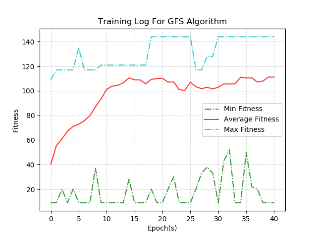
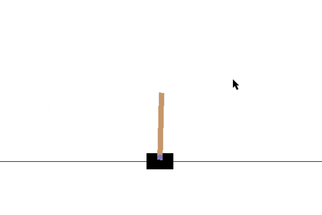

### GeneticFuzzySystem Python Package

该项目是使用 python 实现的 GFS/GFT 算法包，使用时请将GFS包放入项目路径，并在项目文件中引入该工具包进行使用。

（GFS算法原理参考资料可见：[英文版](https://www.cs.princeton.edu/courses/archive/fall07/cos436/HIDDEN/Knapp/fuzzy004.htm)，[中文版](https://blog.csdn.net/qq_38638132/article/details/106477710)）

GFS 库中定义了 BaseGFT 基类，GFT 可以支持训练多个 GFS 控制器，一个控制器用于决策一个特定行为。下面对 GFT 算法包使用方法进行简单介绍，以 Open-AI gym 中 CartPole-v0 场景作为训练示例，示例代码见 "main.py"


> 1. GFT 决策器的使用方法

首先从 GFS 包中引入 BaseGFT 基类，

```python
from GFS.GeneticFuzzySystem import BaseGFT
```

BaseGFT 内置了基本的 GFT 算法所具备的方法函数，但同时也预留了抽象方法需要用户自己实现（主要为算法模块和环境之间的数据交互过程），因此用户需先继承 BaseGFT 基类，在此基础上实现自定义 GFT 子类：

```python
class GFT(BaseGFT):

    def __init__(self, rule_lib_list, population_size, episode, mutation_pro, cross_pro, simulator, parallelized):
        """
        实现自定义GFT子类（继承自BaseGFT基类）并实现自定义计算仿真方法。
        @param rule_lib_list: 规则库对象
        @param population_size: 种群规模（存在的染色体条数，可以理解为存在的规则库个数）
        @param episode: 训练多少轮
        @param mutation_pro: 变异概率
        @param cross_pro: 交叉概率
        @param simulator: 仿真器对象，用于获取观测和回报
        @param parallelized: 是否启用多进程并行计算
        """
        super().__init__(rule_lib_list, population_size, episode, mutation_pro, cross_pro, simulator, parallelized)

    """ 实现父类抽象方法 """
    def start_simulation(self, controllers: list, simulator) -> float:
        """
        自定义 GFT 算法模块与仿真器 Simulator（gym） 之间的数据交互过程，返回仿真器的 reward 值。
        @param simulator: 仿真器对象
        @param controllers: 控制器列表，一个controller决策一个行为。
        @return: fitness
        """
        controller = controllers[0]
        fitness = 0

        obs_list = simulator.reset()
        for _ in range(1000):

            # simulator.render()

            """ CartPole-v0 中共包含 4 个观测，在FIS决策器中需要对应拆分成 4 个模糊变量输入 """
            obs_input = {
                "obs1": obs_list[0],
                "obs2": obs_list[1],
                "obs3": obs_list[2],
                "obs4": obs_list[3]
            }

            action = controller.simulation_get_action(obs_input)    # 利用 FIS 决策器获得行为决策
            obs_list, r, done, _ = simulator.step(action)
            fitness += r

            if done:
                break

        return fitness
```

其中，start_simulation() 方法是用户需要重写的抽象方法，该方法定义了 GFS 算法包如何获取一个规则库的得分（Fitness/Reward），当用户接入不同的仿真环境中时，如何从仿真环境中获取观测（Observation），得分（Reward）等需要在该方法中实现，该函数返回得分值。示例 demo 中以 gym 中 CartPole-v0 场景作为样例，返回 gym env 的 reward 作为 GFS 算法的 Fitness。

主函数一共分为 4 个步骤：构建模糊变量、分配隶属函数、构建规则库对象、构建 GFS 对象，实现流程如下：

```python
if __name__ == '__main__':
    
	""" 1. 构建模糊变量，采用 gym 中 CartPole-v0 作为示例，共包含 4 个观测输入，1 个行为输出 """
    obs1 = FuzzyVariable([-4.9, 4.9], "obs1")
    obs2 = FuzzyVariable([-3.40e+38, 3.40e+38], "obs2")
    obs3 = FuzzyVariable([-0.418, 0.418], "obs3")
    obs4 = FuzzyVariable([-4.18e-01, 4.18e-01], "obs4")

    action = FuzzyVariable([0, 1], "action")

    """ 2. 为模糊变量分配隶属函数 """
    obs1.automf(5)
    obs2.automf(5)
    obs3.automf(5)
    obs4.automf(5)
    action.automf(2, discrete=True)     # 行为输出是离散型的模糊变量

    """ 3. 构建 RuleLib 规则库 """
    controller = RuleLib([obs1, obs2, obs3, obs4, action])

    """ 4. 构建 GFT 对象 """
    gft = GFT(rule_lib_list=[controller], population_size=40, episode=200, mutation_pro=0.1, cross_pro=0.9,
              simulator=simulator, parallelized=True)
    gft.train()
```

运行主函数（main.py），程序运行示意图如下：

<div align=center></div>


> 2. 训练模型保存

每一个 Epoch 训练完成后，训练 model 会存放入入口函数目录下的 `./models` 文件夹下，其中 `AllPopulations` 文件夹下存放整个训练过程中一个种群下的所有个体对象，保存了当前的训练状态，可通过载入种群信息恢复总群状态继续进行训练；`OptimalIndividual` 文件夹下存放了每一代中最优秀的个体对象；`RuleLibAndMF`文件夹下保存了最优个体的规则库和隶属函数参数，文件保存名应为：

```python
[Epoch_N]RuleLib(current_reward)_[No.X].json
或
[Epoch_N]MF(current_reward)_[No.X].json
或
[Epoch_N]Individual(current_reward)_[No.X].json
```

RuleLib 代表规则库存放文件，MF 代表隶属函数参数存放文件，current_reward 代表当前个体的具体得分值，[No.X] 代表规则库编号（用于确认决策哪一个对应的行为），如：

```python
[Epoch_1]RuleLib(834)_[No.0].json
或
[Epoch_1]MF(834)_[No.0].json
或
[Epoch_1]Individual(834)_[No.X].json
```

RuleLib 文件中的数据内容如下：

```python
{
    "RuleLib": [[0, 0, 5], [0, 1, 3], [0, 2, 2], [1, 0, 5], [1, 1, 3], [1, 2, 2], [2, 0, 2], [2, 1, 0], [2, 2, 3]], 
    "chromosome": [5, 3, 2, 5, 3, 2, 2, 0, 3]
}
```

MF 文件中的数据内容如下：

```python
{
    "mf_offset": [[8, -9, -2, -3, -9, -2, 3, 7, -2, 1, 0, 10, 8, 1, 1, -10, -10, -3, 6, 6, 9, -2, 2, 8, -9, -4, 3, -9, 4, -1, -1, -7, 10, 4, -8, -6], [-4, 10, 5, -3, -4, 0, -7, 4, 4, 1, -7, 9, 6, -6, -3, 4, 8, 10, 3, -3, -4, -4, -8, -5, 5, -1, 9, 6, 3, 7, 10, -2, 6, 3, 10, 4]]
}
```

训练过程中的训练曲线保存在：`./models/tarin_log.png`：

<div align=center></div>

> 3. pretrained 模型加载

当模型训练好后，我们可以调用 gft.evalutate() 函数来查看我们训练模型的效果，评估函数中需要输入模型的保存路径，如：

```python
gft.evaluate("models/OptimalIndividuals/[Epoch_47]Individual(144.0).json")
```

模型加载后，修改 start_simulation() 函数，在函数中添加 render() 命令来可视化 CartPole-v0 场景：

```python
    def start_simulation(self, controllers: list, simulator) -> float:
        """
        自定义 GFT 算法模块与仿真器 Simulator（gym） 之间的数据交互过程，返回仿真器的 reward 值。
        @param simulator: 仿真器对象
        @param controllers: 控制器列表，一个controller决策一个行为。
        @return: fitness
        """
        controller = controllers[0]
        fitness = 0
        obs_list = simulator.reset()
        
        for _ in range(1000):

            simulator.render()

            ...
        return fitness
```

得到如下窗口：

<div align=center></div>